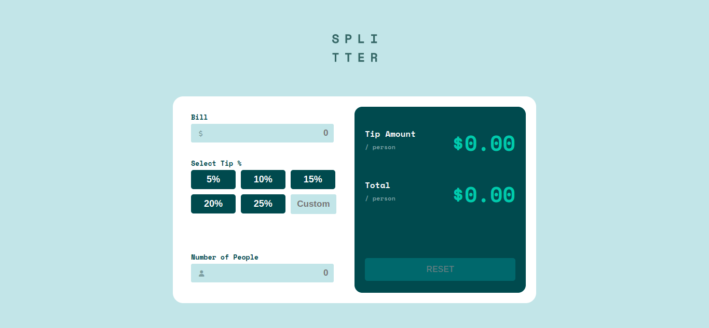
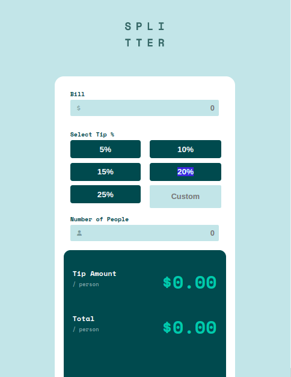

# Frontend Mentor - Tip calculator app solution

This is a solution to the [Tip calculator app challenge on Frontend Mentor](https://www.frontendmentor.io/challenges/tip-calculator-app-ugJNGbJUX). Frontend Mentor challenges help you improve your coding skills by building realistic projects.

## Table of contents

- [Overview](#overview)
  - [The challenge](#the-challenge)
  - [Screenshot](#screenshot)
  - [Links](#links)
- [My process](#my-process)
  - [Built with](#built-with)
  - [What I learned](#what-i-learned)
  - [Continued development](#continued-development)
  - [Useful resources](#useful-resources)
- [Author](#author)
- [Acknowledgments](#acknowledgments)

## Overview

A Frontend Mentor project that uses HTML, CSS and its properties to design a Tip calculator app.

### Screenshot

### Links

- Solution URL: [link](https://github.com/Ayoola32/Tip-calculator-app/)
- Live Site URL: [link](https://ayoola32.github.io/Tip-calculator-app/)

### Built with

- Semantic HTML5 markup
- CSS custom properties
- Flexbox
- CSS Grid
- Mobile-first workflow
- Media Querries

### What I learned

- I was able to understand the concept of flex and its value
- I was able to understand when and why do we use justify-content, align-items, min-max(width) and also min-max(height).
- I was able to work around media querry with a beginners knowledge
- I was able to understand grid and how it works

### Continued development

Currently learning the basic concepts of CSS and its properties. Afterward i would be diving into javascript and also choosing React and my framework, just to build more interactive project

### Useful resources

- [Google](https://www.google.com) - This helped me for finding solution to why and when to use justify-content, align-items, width and max.

## Author

- Website - [Abubakar Sidiq]()
- Frontend Mentor - [@ayoola32](https://www.frontendmentor.io/profile/ayoola32)
- Twitter - [@ayoola_32](https://www.twitter.com/ayoola_32)

## Acknowledgments

All praises and adoration be onto Allah for granting me this priviledge to embark on this journey and making its completion a successful one.
